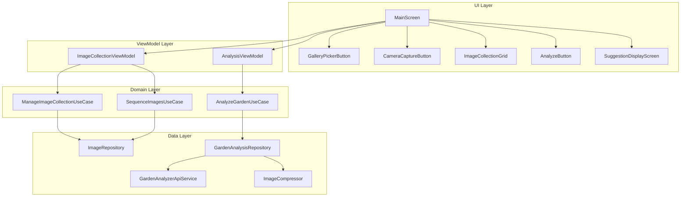
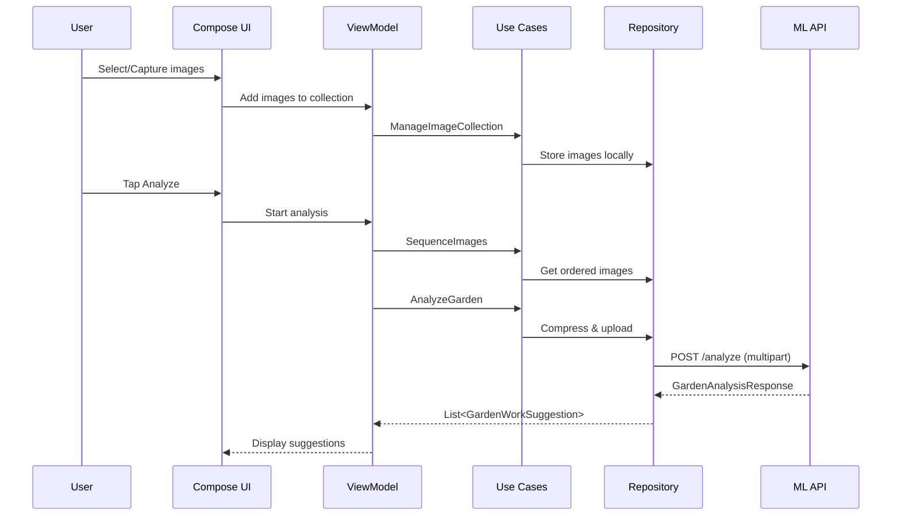

# Design Document: Garden Work Analyzer

## Overview

The Garden Work Analyzer is an Android application built with Kotlin and Jetpack Compose that allows gardeners to capture or select garden images, sequence them, and upload them to an ML model for analysis. The app returns actionable garden work suggestions (pruning, watering, weeding, etc.) based on image inference.

The system follows a clean architecture pattern with three layers: UI (Jetpack Compose), Domain (use cases and models), and Data (repositories, network, device APIs). Image handling leverages Android's `ActivityResultContracts` for gallery picking and camera capture. The ML inference is performed server-side via a REST API backed by a HuggingFace-hosted model (or a custom endpoint), keeping the app lightweight.

Key design decisions:
- **Jetpack Compose** for declarative UI with Material 3 components
- **Kotlin Coroutines + Flow** for async operations (uploads, ML inference)
- **Retrofit + OkHttp** for network communication with the ML endpoint
- **Coil** for efficient image loading and thumbnail rendering
- **Hilt** for dependency injection
- **Server-side ML inference** to avoid bundling large models on-device

## Architecture

The app uses MVVM (Model-View-ViewModel) with a unidirectional data flow pattern.



### Data Flow



## Components and Interfaces

### UI Components

**MainScreen** — Root composable hosting the image collection grid, action buttons, and navigation to results.

**GalleryPickerButton** — Triggers `ActivityResultContracts.GetMultipleContents()` to open the system gallery picker. Filters for `image/jpeg`, `image/png`, `image/webp` MIME types.

**CameraCaptureButton** — Triggers `ActivityResultContracts.TakePicture()` to open the device camera. Hidden when `PackageManager.hasSystemFeature(FEATURE_CAMERA_ANY)` returns false.

**ImageCollectionGrid** — Scrollable grid of image thumbnails with drag-and-drop reordering (via `LazyVerticalGrid` + drag modifiers). Shows image count badge. Supports tap-to-preview and swipe/button-to-remove.

**AnalyzeButton** — Enabled only when `imageCollection.size in 1..10`. Triggers sequencing and upload.

**SuggestionDisplayScreen** — Displays suggestion cards sorted by confidence (descending), filtered to confidence ≥ 0.5. Cards expand on tap to show detailed guidance. Shows analyzed images in a horizontal strip for reference.

### ViewModel Layer

```kotlin
interface ImageCollectionViewModel {
    val imageCollection: StateFlow<List<GardenImage>>
    val imageCount: StateFlow<Int>

    fun addImages(uris: List<Uri>)
    fun removeImage(index: Int)
    fun reorderImages(fromIndex: Int, toIndex: Int)
    fun canAddImages(count: Int): Boolean
}

interface AnalysisViewModel {
    val analysisState: StateFlow<AnalysisUiState>

    fun analyze()
    fun retry()
}
```

### Domain Layer (Use Cases)

```kotlin
class ManageImageCollectionUseCase(private val imageRepository: ImageRepository) {
    fun addImages(uris: List<Uri>): Result<List<GardenImage>>
    fun removeImage(index: Int): Result<List<GardenImage>>
    fun validateFormat(uri: Uri): Boolean
    fun isCollectionFull(currentCount: Int, addCount: Int): Boolean
}

class SequenceImagesUseCase(private val imageRepository: ImageRepository) {
    fun reorder(fromIndex: Int, toIndex: Int): List<GardenImage>
    fun finalizeSequence(): List<SequencedImage>
}

class AnalyzeGardenUseCase(private val analysisRepository: GardenAnalysisRepository) {
    suspend fun execute(images: List<SequencedImage>): Result<GardenAnalysisResult>
}
```

### Data Layer

```kotlin
interface ImageRepository {
    fun getImages(): Flow<List<GardenImage>>
    fun addImages(uris: List<Uri>): Result<List<GardenImage>>
    fun removeImage(index: Int): Result<List<GardenImage>>
    fun reorder(fromIndex: Int, toIndex: Int): List<GardenImage>
    fun getSequencedImages(): List<SequencedImage>
    fun clear()
}

interface GardenAnalysisRepository {
    suspend fun analyze(images: List<SequencedImage>): Result<GardenAnalysisResult>
}

interface GardenAnalyzerApiService {
    @Multipart
    @POST("/analyze")
    suspend fun analyzeImages(
        @Part images: List<MultipartBody.Part>,
        @Part("sequence") sequenceMetadata: RequestBody
    ): Response<GardenAnalysisResponse>
}

class ImageCompressor {
    suspend fun compress(uri: Uri, maxSizeBytes: Long = 2 * 1024 * 1024): ByteArray
}
```

### Permission Handling

```kotlin
class PermissionManager {
    fun checkPermission(permission: String): PermissionStatus
    fun requestPermission(permission: String, launcher: ActivityResultLauncher<String>)
    fun openAppSettings(context: Context)
}

enum class PermissionStatus { GRANTED, DENIED, PERMANENTLY_DENIED }
```

## Data Models

```kotlin
data class GardenImage(
    val uri: Uri,
    val mimeType: String,       // "image/jpeg", "image/png", "image/webp"
    val addedTimestamp: Long,
    val thumbnailUri: Uri? = null
)

data class SequencedImage(
    val image: GardenImage,
    val sequenceIndex: Int       // 1-based index
)

data class GardenWorkSuggestion(
    val type: GardenWorkType,
    val description: String,
    val confidence: Double,      // 0.0 to 1.0
    val detailedGuidance: String
)

enum class GardenWorkType {
    PRUNING, WATERING, WEEDING, PLANTING,
    FERTILIZING, PEST_CONTROL, MULCHING, GENERAL_MAINTENANCE
}

data class GardenAnalysisResult(
    val suggestions: List<GardenWorkSuggestion>,
    val gardenContentDetected: Boolean
)

data class GardenAnalysisResponse(
    val suggestions: List<GardenWorkSuggestionDto>,
    val gardenContentDetected: Boolean
)

data class GardenWorkSuggestionDto(
    val type: String,
    val description: String,
    val confidence: Double,
    val detailedGuidance: String
)

sealed class AnalysisUiState {
    object Idle : AnalysisUiState()
    data class Uploading(val progress: Float) : AnalysisUiState()
    data class Success(val result: GardenAnalysisResult) : AnalysisUiState()
    data class Error(val message: String, val retryCount: Int) : AnalysisUiState()
}

val SUPPORTED_MIME_TYPES = setOf("image/jpeg", "image/png", "image/webp")
const val MAX_IMAGE_COUNT = 10
const val MIN_IMAGE_COUNT = 1
const val MAX_IMAGE_SIZE_BYTES = 2L * 1024 * 1024
const val MAX_RETRY_ATTEMPTS = 3
const val CONFIDENCE_THRESHOLD = 0.5
```

## Correctness Properties

*A property is a characteristic or behavior that should hold true across all valid executions of a system — essentially, a formal statement about what the system should do. Properties serve as the bridge between human-readable specifications and machine-verifiable correctness guarantees.*

### Property 1: Adding images grows the collection

*For any* image collection of size n (where n < 10) and any list of k valid image URIs (where n + k ≤ 10), adding those images to the collection should result in a collection of size n + k, and all added images should be present in the collection.

**Validates: Requirements 1.3, 2.2**

### Property 2: Cancel preserves collection state

*For any* image collection state, a cancel operation (from either gallery picker or camera capture) should leave the collection completely unchanged — same images, same order, same size.

**Validates: Requirements 1.5, 2.6**

### Property 3: Removing an image shrinks the collection

*For any* non-empty image collection and any valid index within that collection, removing the image at that index should decrease the collection size by exactly one, and the removed image should no longer be present in the collection.

**Validates: Requirements 3.3**

### Property 4: Collection size invariant

*For any* sequence of add and remove operations on an image collection, the collection size should always remain between 0 and 10 (inclusive). Any add operation that would cause the size to exceed 10 should be rejected, leaving the collection unchanged.

**Validates: Requirements 3.5, 3.6**

### Property 5: Format validation accepts only supported MIME types

*For any* MIME type string, the format validator should return true if and only if the string is one of "image/jpeg", "image/png", or "image/webp". All other MIME type strings should be rejected.

**Validates: Requirements 1.4, 1.6**

### Property 6: Default ordering matches insertion order

*For any* sequence of image additions (without reordering), the images in the collection should appear in the exact order they were added.

**Validates: Requirements 4.1**

### Property 7: Reorder correctly moves elements

*For any* image collection of size n ≥ 2 and any valid pair (fromIndex, toIndex) where both are in [0, n), the reorder operation should move the element at fromIndex to toIndex, shifting other elements accordingly, without changing the collection size or losing any images.

**Validates: Requirements 4.2**

### Property 8: Finalize produces sequential 1-based indices

*For any* non-empty image collection, finalizing the sequence should produce a list of SequencedImages where the indices are exactly 1, 2, 3, ..., n (matching the current order), and each SequencedImage references the correct original GardenImage.

**Validates: Requirements 4.3, 4.4**

### Property 9: Compression output is within size limit

*For any* image (regardless of original size), after compression the output byte array should be at most 2,097,152 bytes (2 MB).

**Validates: Requirements 5.3**

### Property 10: Suggestion DTO maps to valid domain model

*For any* GardenWorkSuggestionDto with a valid type string (matching a GardenWorkType enum value) and a confidence value in [0.0, 1.0], mapping to a GardenWorkSuggestion should produce a domain object with the correct enum type and the same confidence value. DTOs with invalid type strings or out-of-range confidence values should fail mapping.

**Validates: Requirements 6.2, 6.3**

### Property 11: Displayed suggestions contain required fields

*For any* GardenWorkSuggestion, the display representation should include the suggestion type name, the description text, and the confidence score.

**Validates: Requirements 7.1**

### Property 12: Suggestions are sorted by confidence descending

*For any* list of GardenWorkSuggestions, after sorting for display, each suggestion's confidence score should be greater than or equal to the confidence score of the next suggestion in the list.

**Validates: Requirements 7.2**

### Property 13: Only high-confidence suggestions are displayed

*For any* list of GardenWorkSuggestions, after filtering for display, every suggestion in the result should have a confidence score ≥ 0.5, and no suggestion with confidence ≥ 0.5 from the original list should be missing.

**Validates: Requirements 7.3**

## Error Handling

| Scenario | Component | Behavior |
|---|---|---|
| Unsupported image format selected | Gallery_Picker | Show error toast with supported formats (JPEG, PNG, WebP). Do not add image to collection. |
| Collection at max capacity (10) | ManageImageCollectionUseCase | Reject addition, return error result. UI shows "Maximum of 10 images reached" message. |
| No camera on device | CameraCaptureButton | Hide camera button entirely. Only gallery option visible. |
| Camera permission denied | PermissionManager | Show dialog explaining camera permission is needed with "Open Settings" button. |
| Storage permission denied | PermissionManager | Show dialog explaining storage permission is needed with "Open Settings" button. |
| Network error during upload | Image_Uploader | Show error with retry button. Auto-retry up to 3 times with exponential backoff. |
| 3 retries exhausted | Image_Uploader | Show "Check your network connection" message with manual retry option. |
| ML endpoint unreachable | GardenAnalysisRepository | Show "Service temporarily unavailable" message. |
| No garden content detected | Suggestion_Display | Show "No garden content detected in the provided images" message. |
| No suggestions returned | Suggestion_Display | Show "No garden work suggestions identified" message. |
| Image compression failure | ImageCompressor | Log error, skip the problematic image, notify user if all images fail. |
| Empty collection at analyze | Image_Sequencer | Disable analyze button. Show prompt to add images. |
| Invalid API response (bad type string) | GardenAnalysisRepository | Map unknown types to GENERAL_MAINTENANCE as fallback. Log warning. |
| Confidence score out of range | GardenAnalysisRepository | Clamp to [0.0, 1.0] range. Log warning. |

## Testing Strategy

### Unit Tests

Unit tests cover specific examples, edge cases, and integration points:

- Gallery picker returns empty list on cancel — collection unchanged
- Camera capture with no camera available — button hidden
- Permission denied scenarios — correct error messages shown
- Adding exactly 10 images — succeeds
- Adding 11th image — rejected with error
- Empty collection — analyze button disabled
- Network failure on upload — error state with retry
- 3 retries exhausted — final error message
- ML endpoint returns no garden content — appropriate UI message
- ML endpoint returns no suggestions — appropriate UI message
- Suggestion with confidence exactly 0.5 — included in display
- Suggestion with confidence 0.49 — excluded from display
- HTTPS URL validation for API endpoint

### Property-Based Tests

Property-based tests use a PBT library (e.g., **Kotest** with its property testing module) to verify universal properties across generated inputs. Each test runs a minimum of 100 iterations.

Each property test must be tagged with a comment referencing the design property:

```kotlin
// Feature: garden-work-analyzer, Property 1: Adding images grows the collection
```

| Property | Test Description | Generator Strategy |
|---|---|---|
| Property 1 | Add k images to collection of size n, verify size = n + k | Random n in [0,9], random k in [1, 10-n], random URIs |
| Property 2 | Cancel operation on random collection, verify unchanged | Random collections of size [0,10] |
| Property 3 | Remove at random valid index, verify size decreases by 1 | Random non-empty collections, random valid index |
| Property 4 | Sequence of random add/remove ops, verify size in [0,10] | Random operation sequences |
| Property 5 | Random MIME type strings, verify accept/reject | Mix of valid MIME types and random strings |
| Property 6 | Add images in sequence, verify order matches insertion | Random lists of URIs |
| Property 7 | Reorder with random (from, to), verify element moved correctly | Random collections size ≥ 2, random valid index pairs |
| Property 8 | Finalize random collection, verify 1-based sequential indices | Random non-empty collections |
| Property 9 | Compress random image data, verify output ≤ 2MB | Random byte arrays of varying sizes |
| Property 10 | Map random valid/invalid DTOs, verify correct mapping or failure | Random type strings and confidence values |
| Property 11 | Render random suggestions, verify all fields present | Random GardenWorkSuggestion instances |
| Property 12 | Sort random suggestion lists, verify descending confidence order | Random lists of suggestions with random confidence values |
| Property 13 | Filter random suggestion lists, verify all results ≥ 0.5 threshold | Random lists with confidence values spanning [0.0, 1.0] |

### Testing Tools

- **Kotest** — Kotlin testing framework with built-in property-based testing support (`kotest-property`)
- **MockK** — Mocking library for Kotlin coroutines and Android dependencies
- **Turbine** — Testing library for Kotlin Flow
- **Robolectric** — For Android-specific unit tests without a device
